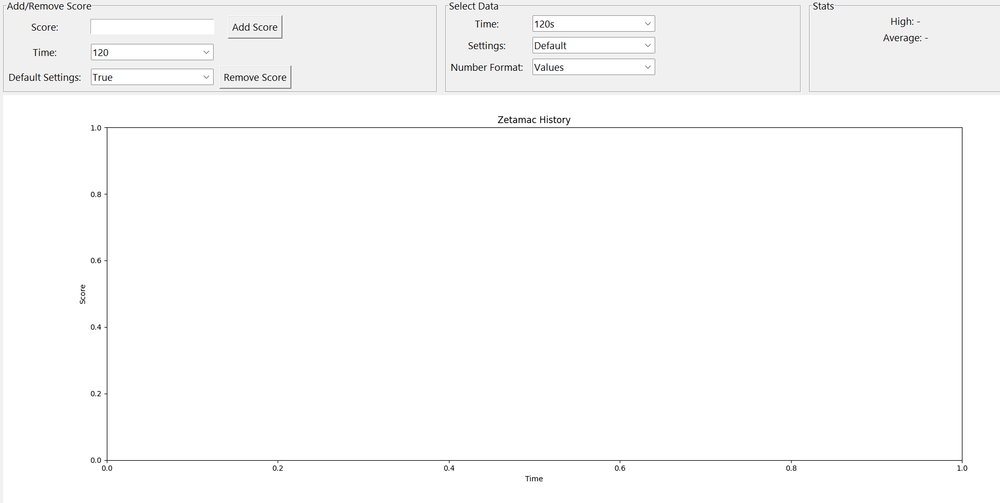

# Zetamaxx: WIP
Zetamac progress-tracking Python app
Built with pandas, matplotlib, tkinter, and immense struggle
## Preview

## How to Use
1. Go to the "Releases" section of the page
2. Download the zip
3. Start Zetamaxxing!
## How to Build with Pyinstaller
You can also build the repo yourself with Pyinstaller
1. Install Python
2. Clone the repo
3. Create a venv and activate it
4. Use pip to install requirements
5. Run `pyinstaller --noconsole --name zetamaxx --add-data "icon.png:." --icon "icon.png" app.py`
## To Dos
- Visual updates
    - Show removed rows
- Chrome/Firefox extension
    - To be designed in the future